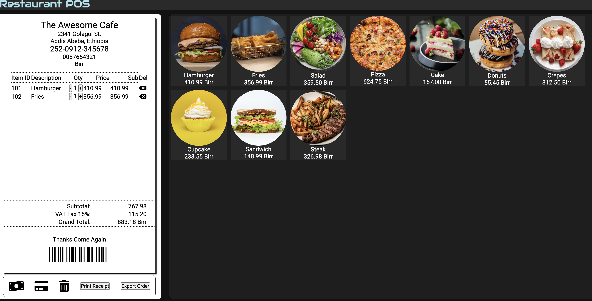

# Restaurant POS - Basic Point of Sale


**Restaurant POS** is a basic point-of-sale application built with **HTML, CSS, and JavaScript (ES6)**.  
It allows you to:

- Add menu items to an order.
- Adjust quantities dynamically.
- Automatically calculate **Subtotal**, **VAT (15%)**, and **Grand Total** in **Birr**.
- Print receipts or export them as PDFs using **jsPDF**.

> ⚠️ Note: This is a learning project. It does **not include data validation** or advanced POS features and is **not ready for production**.

---

## Demo Video
Watch a walkthrough of the app creation here sample:  
[Watch Video](https://gerarisaactc.iceiy.com/?i=1)

---

## Screenshot
 


---

## Installation
1. Clone the repository:  
   ```bash
   git clone https://github.com/Habtom-great/restaurant-pos.git
Open the project folder in VS Code (or your preferred editor).

Open index.html in a browser to run the POS locally.

Usage
Click a menu item to add it to the order.

Click the quantity cell to increase or decrease items; totals update automatically.

Subtotal, VAT (15%), and Grand Total are calculated in real-time.

Final Grand Total is displayed in Birr.

Click Print to print the receipt or Export to save it as a PDF.

Features
Add menu items with images, descriptions, and prices.

Adjust item quantities dynamically.

Automatic calculation of subtotal, VAT, and grand total.

Print or export receipts in PDF format.

Clean and modern UI for restaurant POS systems.

Technologies Used
HTML5

CSS3

JavaScript (ES6)

jsPDF for PDF export

Contributing
This project is for learning purposes. Contributions are welcome!

Fork the repository.

Make your changes in a branch.

Create a pull request.

Support
If this project helped you learn web development or POS concepts, you can support me:
Buy me a coffee via PayPal